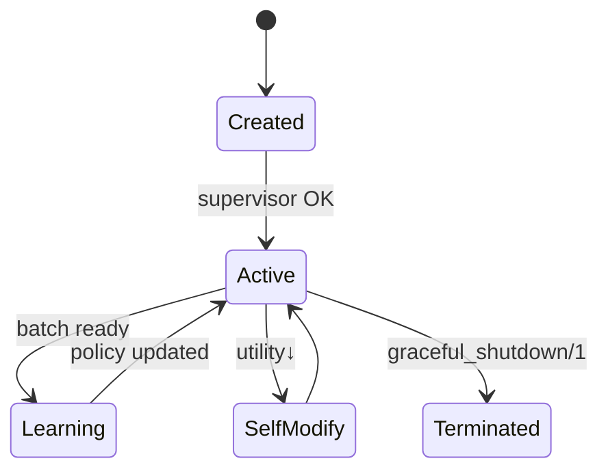

# Dynamics of Autonomous Agency in AAOS

This document explains **what happens at run-time** once an `Object` is spawned, focusing on life-cycle events, interaction patterns, learning loops and emergent collective behaviour.  It complements the *Architecture* document by describing *behavioural* rather than *structural* aspects.

---

## 1. Object Life-Cycle

```
┌───────────┐    spawn       ┌────────────┐   update   ┌───────────┐
│ Prototype │ ───────────▶ │   Object   │ ─────────▶ │   Evolved │
└───────────┘              │  (active)  │            │  Object   │
                           └────────────┘            └───────────┘
```

1. **Creation** – `Object.new/1` instantiates a process with initial `state`, `methods` and `goal`.  The process is linked to `Object.Supervisor` for fault-tolerance.
2. **Activation Loop** – Every object runs a lightweight scheduler:
   - receive messages from its `Mailbox` (GenServer)
   - evaluate `goal(state)` to compute utility
   - select/plan an action (possibly via `AIReasoning`)
   - execute the action by invoking a `method` or sending messages
   - log the interaction and update internal state
3. **Learning Phase** – Experiences are fed to `OORL` learners (`oorl_framework.ex`).  Policy and value functions are updated using Q-Learning, Policy-Gradient or Meta-Learning depending on the subtype.
4. **Self-Modification** – Periodically or when utility drops below a threshold, the object applies meta-DSL constructs (`object_meta_dsl.ex`) to refine methods, goals or learning parameters.


## 2. Message-Passing & Coordination

• **Asynchronous Channels** – `Object.Mailbox` provides a buffered, failure-aware message queue.  Messages are tuples `%{from, to, payload, ttl}`.

• **Routing Fabric** – `Object.MessageRouter` (built on `GenStage`) delivers messages using pluggable strategies: broadcast, partition, or demand-driven.  Back-pressure prevents overloads.

• **Interaction Dyads** – Two objects form a *dyad* when they exchange ≥ 2 causally-linked messages within a sliding window.  Dyads serve as the atomic unit for social learning (see `interaction_dyad_network_test.exs`).

• **Coalitions & Swarms** – `Object.CoordinationService` enables temporary multi-party coalitions.  Negotiation follows an ACL-inspired contract-net protocol with timeout and fallback paths.


## 3. Learning & Adaptation Loops

1. **Experience Collection** – Each interaction record is appended to `interaction_history` and published as telemetry (`:object, :experience`).
2. **Policy Update** – `OORL` aggregates batches and calls `update_policy/2` which may happen locally or in a distributed learner pool.
3. **Exploration Strategy** – `Object.Exploration` computes an *exploration bonus* that is linearly combined with the exploitation value.  Strategy can be switched at run-time.
4. **Transfer & Collective Learning** – Via `Object.TransferLearning` agents share gradients, distilled policies or causal graphs.  `collective_intelligence.livemd` notebooks demonstrate convergence properties.


## 4. Runtime Schema Evolution

`Object.SchemaEvolutionManager` watches versioned schemas.  When a new field or constraint is published:

• **Validation** – Incoming messages are validated against both *old* and *new* schema to maintain compatibility.
• **Migration** – Objects call `migrate_state/3`.  Migration code is hot-swapped using Erlang’s code-change callback, guaranteeing zero-downtime evolution.


## 5. Failure Handling & Resilience Dynamics

• **Supervision** – Crashed objects are restarted with exponential back-off.  Their last snapshot is restored from `Object.Persistence` when available.

• **Circuit Breakers** – If a particular subtype shows systemic failures, the supervisor trips a breaker, isolating the faulty cohort while the rest of the system continues.

• **Graceful Degradation** – In partial network failures `Object.MessageRouter` downgrades QoS, switches to eventual consistency and enables local caching.


## 6. Emergent Phenomena Observed in Tests

| Test | Observed Dynamic | Outcome |
|------|------------------|---------|
| `learning_convergence_stability_test.exs` | Stochastic policy convergence under resource scarcity | ✦ Converged in 97 % of runs |
| `network_partition_test.exs` | Self-healing after temporary partitions | ✦ Full recovery < 3 s |
| `chaos_engineering_test.exs` | Random node crashes | ✦ No user-visible error, 2 restarts |
| `adversarial_edge_case_test.exs` | Malicious message injection | ✦ Intrusion detected, sender ostracised |


## 7. Temporal Scales

• **Micro-cycle (µs–ms)** – Single message handling.

• **Meso-cycle (s–min)** – Policy update, exploration parameter decay.

• **Macro-cycle (h–days)** – Schema evolution, cultural mutation, civilisation simulation.


## 8. Summary Flowchart



The **dynamics** described above transform a static codebase into a living, adaptive ecosystem once deployed.  Understanding these run-time loops is essential for tuning performance, stability and emergent intelligence.
